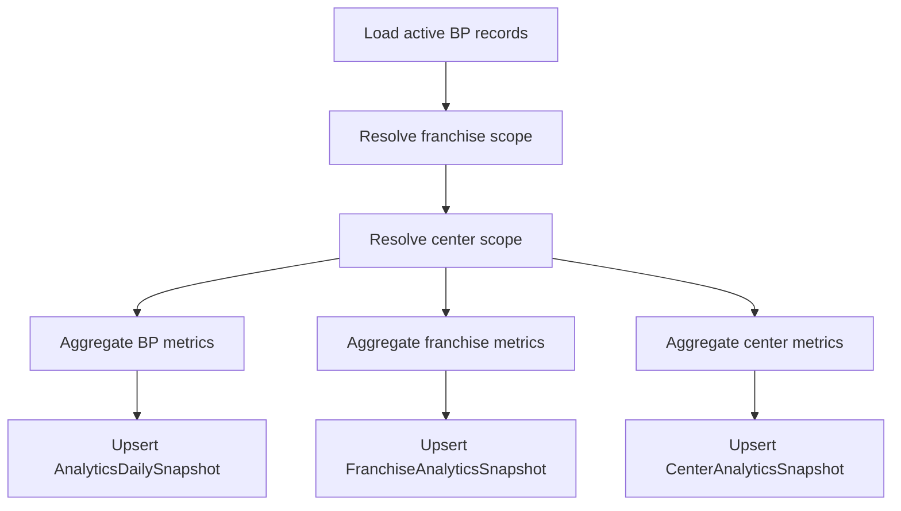

# BP Phase 1 Backend Foundation

This document defines the backend and Prisma implementation foundation for Phase 1 of the Business Partner redesign.

It is aligned to the current codebase, specifically:

- `prisma/schema.prisma`
- `src/middleware/partner-scope.js`
- `src/routes/partner.routes.js`
- `src/controllers/partner.controller.js`

Important integration note:

- the current system role value is `BP`
- existing middleware already attaches `req.bpScope`
- existing ownership still depends on `FranchiseProfile.businessPartnerId`

This Phase 1 design keeps those stable and layers explicit scope ownership on top.

---

## 1. Updated Prisma Models

### New Enums

Add enums instead of reusing unrelated status fields. This keeps BP ownership lifecycle explicit.

```prisma
enum BusinessPartnerOwnershipType {
  PRIMARY
  SECONDARY
  ADVISORY
}

enum BusinessPartnerScopeType {
  DIRECT
  OVERRIDE
}

enum BusinessPartnerScopeStatus {
  ACTIVE
  INACTIVE
  SUSPENDED
}
```

### A. BusinessPartnerFranchise

Purpose:

- explicit BP ownership of franchises
- support future multi-BP assignment models
- remove long-term dependency on a single legacy foreign key

Use existing relation target names from the schema:

- `BusinessPartner.id`
- `FranchiseProfile.id`

```prisma
model BusinessPartnerFranchise {
  id                 String                     @id @default(cuid())
  tenantId           String
  businessPartnerId  String
  franchiseId        String
  ownershipType      BusinessPartnerOwnershipType @default(PRIMARY)
  status             BusinessPartnerScopeStatus   @default(ACTIVE)
  activeFrom         DateTime                   @default(now())
  activeTo           DateTime?
  createdAt          DateTime                   @default(now())
  updatedAt          DateTime                   @updatedAt

  tenant            Tenant           @relation(fields: [tenantId], references: [id], onDelete: Restrict)
  businessPartner   BusinessPartner  @relation(fields: [businessPartnerId], references: [id], onDelete: Cascade)
  franchise         FranchiseProfile @relation(fields: [franchiseId], references: [id], onDelete: Cascade)

  @@unique([businessPartnerId, franchiseId])
  @@index([tenantId, businessPartnerId, status])
  @@index([tenantId, franchiseId, status])
  @@index([tenantId, businessPartnerId, activeFrom, activeTo])
  @@map("businesspartnerfranchise")
}
```

### B. BusinessPartnerCenterScope

Purpose:

- direct BP ownership or override access for specific centers
- support centers that must be included outside normal franchise ownership

Use existing relation target name `CenterProfile.id`.

```prisma
model BusinessPartnerCenterScope {
  id                 String                    @id @default(cuid())
  tenantId           String
  businessPartnerId  String
  centerId           String
  scopeType          BusinessPartnerScopeType   @default(DIRECT)
  status             BusinessPartnerScopeStatus @default(ACTIVE)
  activeFrom         DateTime                  @default(now())
  activeTo           DateTime?
  createdAt          DateTime                  @default(now())
  updatedAt          DateTime                  @updatedAt

  tenant            Tenant          @relation(fields: [tenantId], references: [id], onDelete: Restrict)
  businessPartner   BusinessPartner @relation(fields: [businessPartnerId], references: [id], onDelete: Cascade)
  center            CenterProfile   @relation(fields: [centerId], references: [id], onDelete: Cascade)

  @@unique([businessPartnerId, centerId])
  @@index([tenantId, businessPartnerId, status])
  @@index([tenantId, centerId, status])
  @@index([tenantId, businessPartnerId, activeFrom, activeTo])
  @@map("businesspartnercenterscope")
}
```

### C. Analytics Snapshot Tables

Phase 1 should not do live heavy aggregation for every dashboard load. Use daily snapshots.

#### AnalyticsDailySnapshot

This is the top-level BP summary source.

```prisma
model AnalyticsDailySnapshot {
  id                   String   @id @default(cuid())
  tenantId             String
  businessPartnerId    String
  snapshotDate         DateTime
  totalStudents        Int      @default(0)
  activeStudents       Int      @default(0)
  totalFranchises      Int      @default(0)
  activeCenters        Int      @default(0)
  monthlyCollections   Decimal  @default(0) @db.Decimal(12, 2)
  pendingFees          Decimal  @default(0) @db.Decimal(12, 2)
  newAdmissions        Int      @default(0)
  studentGrowthPercent Decimal  @default(0) @db.Decimal(8, 2)
  createdAt            DateTime @default(now())
  updatedAt            DateTime @updatedAt

  tenant            Tenant          @relation(fields: [tenantId], references: [id], onDelete: Restrict)
  businessPartner   BusinessPartner @relation(fields: [businessPartnerId], references: [id], onDelete: Cascade)

  @@unique([businessPartnerId, snapshotDate])
  @@index([tenantId, businessPartnerId, snapshotDate])
  @@index([tenantId, snapshotDate])
  @@map("analyticsdailysnapshot")
}
```

#### FranchiseAnalyticsSnapshot

```prisma
model FranchiseAnalyticsSnapshot {
  id                   String   @id @default(cuid())
  tenantId             String
  businessPartnerId    String
  franchiseId          String
  snapshotDate         DateTime
  studentCount         Int      @default(0)
  activeStudents       Int      @default(0)
  monthlyCollections   Decimal  @default(0) @db.Decimal(12, 2)
  pendingFees          Decimal  @default(0) @db.Decimal(12, 2)
  centerCount          Int      @default(0)
  teacherCount         Int      @default(0)
  growthPercent        Decimal  @default(0) @db.Decimal(8, 2)
  healthScore          Decimal  @default(0) @db.Decimal(8, 2)
  createdAt            DateTime @default(now())
  updatedAt            DateTime @updatedAt

  tenant            Tenant           @relation(fields: [tenantId], references: [id], onDelete: Restrict)
  businessPartner   BusinessPartner  @relation(fields: [businessPartnerId], references: [id], onDelete: Cascade)
  franchise         FranchiseProfile @relation(fields: [franchiseId], references: [id], onDelete: Cascade)

  @@unique([franchiseId, snapshotDate])
  @@index([tenantId, businessPartnerId, snapshotDate])
  @@index([tenantId, franchiseId, snapshotDate])
  @@map("franchiseanalyticssnapshot")
}
```

#### CenterAnalyticsSnapshot

```prisma
model CenterAnalyticsSnapshot {
  id                   String   @id @default(cuid())
  tenantId             String
  businessPartnerId    String
  franchiseId          String
  centerId             String
  snapshotDate         DateTime
  activeStudents       Int      @default(0)
  attendancePercent    Decimal  @default(0) @db.Decimal(8, 2)
  monthlyRevenue       Decimal  @default(0) @db.Decimal(12, 2)
  pendingFees          Decimal  @default(0) @db.Decimal(12, 2)
  teacherCount         Int      @default(0)
  studentGrowthPercent Decimal  @default(0) @db.Decimal(8, 2)
  retentionPercent     Decimal  @default(0) @db.Decimal(8, 2)
  healthScore          Decimal  @default(0) @db.Decimal(8, 2)
  createdAt            DateTime @default(now())
  updatedAt            DateTime @updatedAt

  tenant            Tenant           @relation(fields: [tenantId], references: [id], onDelete: Restrict)
  businessPartner   BusinessPartner  @relation(fields: [businessPartnerId], references: [id], onDelete: Cascade)
  franchise         FranchiseProfile @relation(fields: [franchiseId], references: [id], onDelete: Cascade)
  center            CenterProfile    @relation(fields: [centerId], references: [id], onDelete: Cascade)

  @@unique([centerId, snapshotDate])
  @@index([tenantId, businessPartnerId, snapshotDate])
  @@index([tenantId, franchiseId, snapshotDate])
  @@index([tenantId, centerId, snapshotDate])
  @@map("centeranalyticssnapshot")
}
```

### Relation Additions To Existing Models

Add these relations only. Do not remove current fields.

In `BusinessPartner`:

```prisma
franchiseScopes      BusinessPartnerFranchise[]
centerScopes         BusinessPartnerCenterScope[]
analyticsSnapshots   AnalyticsDailySnapshot[]
franchiseSnapshots   FranchiseAnalyticsSnapshot[]
centerSnapshots      CenterAnalyticsSnapshot[]
```

In `FranchiseProfile`:

```prisma
bpOwnerships         BusinessPartnerFranchise[]
analyticsSnapshots   FranchiseAnalyticsSnapshot[]
centerSnapshots      CenterAnalyticsSnapshot[]
```

In `CenterProfile`:

```prisma
bpScopes             BusinessPartnerCenterScope[]
analyticsSnapshots   CenterAnalyticsSnapshot[]
```

---

## 2. Migration Plan

### Goal

Add explicit BP scope without breaking existing production logic that still uses:

- `FranchiseProfile.businessPartnerId`
- hierarchy traversal
- `req.bpScope`

### Safe Rollout Plan

#### Step 1: Add New Tables Only

- deploy Prisma schema with new models and enums
- no controller behavior changes yet
- no existing route breakage

#### Step 2: Backfill BusinessPartnerFranchise

Backfill source:

- `FranchiseProfile.businessPartnerId`

Backfill rule:

- for every active `FranchiseProfile`, insert one `BusinessPartnerFranchise` row with:
  - `ownershipType = PRIMARY`
  - `status = ACTIVE`
  - `activeFrom = createdAt` or `now()`

Pseudo-SQL shape:

```sql
INSERT INTO businesspartnerfranchise (...)
SELECT ... FROM franchiseprofile
WHERE businessPartnerId IS NOT NULL
ON CONFLICT DO NOTHING;
```

#### Step 3: Keep Dual Read

Scope resolution order in Phase 1:

1. explicit `BusinessPartnerFranchise`
2. explicit `BusinessPartnerCenterScope`
3. legacy `FranchiseProfile.businessPartnerId` fallback
4. existing hierarchy resolution only after scope ids are derived

#### Step 4: Switch Middleware To Explicit Scope First

- do not change route contract
- keep `req.bpScope.businessPartner`
- keep `req.bpScope.hierarchyNodeIds`
- add `franchiseIds` and `centerIds` internally

#### Step 5: Snapshot Jobs

- deploy snapshot tables
- run backfill for recent 30 to 90 days if needed
- dashboard endpoints may fall back to live aggregation until snapshots exist

#### Step 6: Deprecation Later

After Phase 1 stabilizes:

- shift internal logic away from direct reads of `FranchiseProfile.businessPartnerId`
- keep field until all reads are migrated

### Fallback Handling

If explicit scope tables are empty for a BP:

- build scope from legacy `FranchiseProfile.businessPartnerId`
- if still empty, attach empty scope arrays
- never default to tenant-wide access

That last rule is mandatory.

---

## 3. BP Scope Service Design

Create:

- `src/services/bp-scope.service.js`

This becomes the single source of truth for BP access resolution.

### Responsibilities

- resolve BP record for current user
- resolve explicit franchise scope
- resolve explicit direct center scope
- derive centers from accessible franchises
- merge and normalize scope
- validate resource access
- support legacy fallback during transition

### Recommended Public API

```js
async function resolveBusinessPartnerScope({ tenantId, userId }) {}
async function getAccessibleFranchiseIds({ tenantId, businessPartnerId }) {}
async function getAccessibleCenterIds({ tenantId, businessPartnerId, franchiseIds }) {}
function validateFranchiseAccess({ bpScope, franchiseId }) {}
function validateCenterAccess({ bpScope, centerId }) {}
```

### Example Implementation Shape

```js
import { prisma } from "../lib/prisma.js";

async function resolveBusinessPartnerScope({ tenantId, userId }) {
  const businessPartner = await resolveBusinessPartnerForUser({ tenantId, userId });
  if (!businessPartner) {
    return null;
  }

  const explicitFranchises = await prisma.businessPartnerFranchise.findMany({
    where: {
      tenantId,
      businessPartnerId: businessPartner.id,
      status: "ACTIVE",
      OR: [
        { activeTo: null },
        { activeTo: { gte: new Date() } }
      ]
    },
    select: { franchiseId: true }
  });

  let franchiseIds = explicitFranchises.map((row) => row.franchiseId);

  if (!franchiseIds.length) {
    const legacyFranchises = await prisma.franchiseProfile.findMany({
      where: {
        tenantId,
        businessPartnerId: businessPartner.id,
        status: { not: "ARCHIVED" }
      },
      select: { id: true }
    });
    franchiseIds = legacyFranchises.map((row) => row.id);
  }

  const directCenters = await prisma.businessPartnerCenterScope.findMany({
    where: {
      tenantId,
      businessPartnerId: businessPartner.id,
      status: "ACTIVE",
      OR: [
        { activeTo: null },
        { activeTo: { gte: new Date() } }
      ]
    },
    select: { centerId: true }
  });

  const franchiseCenters = franchiseIds.length
    ? await prisma.centerProfile.findMany({
        where: {
          tenantId,
          franchiseProfileId: { in: franchiseIds },
          status: { not: "ARCHIVED" }
        },
        select: {
          id: true,
          authUser: { select: { hierarchyNodeId: true } }
        }
      })
    : [];

  const directCenterIds = directCenters.map((row) => row.centerId);
  const centerIds = Array.from(new Set([
    ...directCenterIds,
    ...franchiseCenters.map((row) => row.id)
  ]));

  const hierarchyNodeIds = franchiseCenters
    .map((row) => row.authUser?.hierarchyNodeId)
    .filter(Boolean);

  return {
    businessPartner,
    franchiseIds,
    centerIds,
    hierarchyNodeIds
  };
}
```

### Cache Strategy

Do not cache forever. BP ownership can change.

Practical Phase 1 cache:

- in-memory LRU or Redis if available
- TTL 60 to 180 seconds
- key: `bp-scope:{tenantId}:{userId}`

Cache invalidation triggers:

- BP assignment change
- franchise reassignment
- center direct-scope change

### Query Helper Examples

```js
function buildBpStudentWhere({ tenantId, bpScope }) {
  return {
    tenantId,
    hierarchyNodeId: { in: bpScope.hierarchyNodeIds.length ? bpScope.hierarchyNodeIds : ["__NO_BP_SCOPE__"] }
  };
}

function buildBpCenterWhere({ tenantId, bpScope }) {
  return {
    tenantId,
    id: { in: bpScope.centerIds.length ? bpScope.centerIds : ["__NO_BP_SCOPE__"] }
  };
}
```

---

## 4. Middleware Refactor

### Constraint

Keep `req.bpScope` contract unchanged for current consumers.

Current critical fields that must remain:

- `req.bpScope.businessPartner`
- `req.bpScope.hierarchyNodeIds`

You can safely add:

- `req.bpScope.franchiseIds`
- `req.bpScope.centerIds`

### Recommended Middleware Architecture

File stays:

- `src/middleware/partner-scope.js`

Internal flow changes to:

1. validate `req.auth.role === "BP"`
2. resolve BP record via scope service
3. resolve explicit scope first
4. derive hierarchy node ids from resolved centers
5. attach normalized `req.bpScope`
6. record audit metadata

### Sample Refactor Shape

```js
const requireBusinessPartnerScope = asyncHandler(async (req, res, next) => {
  if (!req.auth || req.auth.role !== "BP") {
    return res.apiError(403, "Business partner role required", "BP_ROLE_REQUIRED");
  }

  const resolved = await resolveBusinessPartnerScope({
    tenantId: req.auth.tenantId,
    userId: req.auth.userId
  });

  if (!resolved?.businessPartner) {
    return res.apiError(403, "Business partner scope not resolved", "BP_SCOPE_REQUIRED");
  }

  const safeNodeIds = resolved.hierarchyNodeIds.length
    ? resolved.hierarchyNodeIds
    : ["__NO_BP_SCOPE__"];

  req.bpScope = {
    businessPartner: resolved.businessPartner,
    hierarchyNodeIds: safeNodeIds,
    franchiseIds: resolved.franchiseIds,
    centerIds: resolved.centerIds
  };

  return next();
});
```

### Security Rules

- if BP has no scope, do not omit filters
- use sentinel impossible ids when scope is empty
- never treat empty scope as unrestricted
- always include `tenantId` in all downstream filters

---

## 5. Dashboard API Design

### Recommended Phase 1 Routes

Add BP-specific endpoints rather than growing current `/partner/dashboard` further.

```text
GET /bp/dashboard/overview
GET /bp/dashboard/revenue-trend
GET /bp/dashboard/student-growth-trend
GET /bp/dashboard/franchise-ranking
GET /bp/dashboard/center-health
```

You may temporarily keep `/partner/dashboard` as a wrapper during transition.

### Endpoint Responsibilities

#### GET /bp/dashboard/overview

Returns KPI cards only:

- Total Students
- Active Students
- Total Franchises
- Active Centers
- Monthly Collections
- Pending Fees
- New Admissions
- Student Growth %

Suggested response:

```json
{
  "meta": {
    "generatedAt": "2026-05-09T10:00:00.000Z",
    "snapshotDate": "2026-05-09"
  },
  "kpis": {
    "totalStudents": 1220,
    "activeStudents": 1148,
    "totalFranchises": 8,
    "activeCenters": 31,
    "monthlyCollections": 1842500,
    "pendingFees": 231000,
    "newAdmissions": 84,
    "studentGrowthPercent": 6.8
  }
}
```

#### GET /bp/dashboard/revenue-trend

Returns monthly trend series.

#### GET /bp/dashboard/student-growth-trend

Returns active student count and admissions trend series.

#### GET /bp/dashboard/franchise-ranking

Returns franchise summary ranking by growth, collection, or health.

#### GET /bp/dashboard/center-health

Returns center health summary list or heatmap-ready payload.

### Route Protection

All of these routes must use:

- `requireRole("BP")`
- `requireBusinessPartnerScope`

### Prisma Query Pattern

For overview from snapshots:

```js
const snapshot = await prisma.analyticsDailySnapshot.findFirst({
  where: {
    tenantId,
    businessPartnerId: req.bpScope.businessPartner.id
  },
  orderBy: { snapshotDate: "desc" }
});
```

For franchise ranking:

```js
const items = await prisma.franchiseAnalyticsSnapshot.findMany({
  where: {
    tenantId,
    businessPartnerId: req.bpScope.businessPartner.id,
    franchiseId: { in: req.bpScope.franchiseIds }
  },
  orderBy: [
    { snapshotDate: "desc" },
    { healthScore: "desc" }
  ],
  take: 10
});
```

### Caching Recommendation

- overview: 60 to 120 seconds
- trends: 5 minutes
- rankings: 5 minutes

Cache key shape:

- `bp:dashboard:overview:{tenantId}:{bpId}:{month}`

---

## 6. Snapshot Job Architecture

### Goal

Avoid expensive real-time aggregation across students, fees, attendance, and centers on every BP dashboard request.

### Phase 1 Job Design

Create one scheduled job group:

- `src/jobs/bp-daily-snapshot.job.js`

### Daily Aggregation Flow



### Aggregation Strategy

For each BP and target date:

1. resolve effective scope once
2. aggregate current-period metrics in batches
3. aggregate previous-period active student counts for growth calculation
4. compute health scores in application layer
5. upsert snapshot rows

### Incremental Refresh Strategy

Phase 1 practical approach:

- full daily snapshot at night
- optional refresh for current day every few hours
- on-demand rebuild script for one BP/date range

### Upsert Pattern

```js
await prisma.analyticsDailySnapshot.upsert({
  where: {
    businessPartnerId_snapshotDate: {
      businessPartnerId,
      snapshotDate
    }
  },
  update: payload,
  create: payload
});
```

### Metrics Source Suggestions

- students: `Student`
- centers: `CenterProfile`
- franchises: `FranchiseProfile`
- collections: `FinancialTransaction`
- pending fees: installment or invoice schedule tables already in schema
- attendance: attendance session and entry tables

### Health Score Logic

Franchise health:

$$
HealthScore = 0.35 \times CollectionScore + 0.25 \times GrowthScore + 0.20 \times StudentActivityScore + 0.20 \times TeacherCoverageScore
$$

Center health:

$$
HealthScore = 0.30 \times CollectionScore + 0.25 \times GrowthScore + 0.25 \times AttendanceScore + 0.20 \times RetentionScore
$$

---

## 7. Prisma Query Optimization

### Core Rules

- always filter by `tenantId`
- always intersect with `req.bpScope`
- prefer snapshot reads for dashboard and ranking APIs
- avoid loading full relation graphs for KPI endpoints

### Index Recommendations

Critical new indexes:

- `BusinessPartnerFranchise(tenantId, businessPartnerId, status)`
- `BusinessPartnerCenterScope(tenantId, businessPartnerId, status)`
- `AnalyticsDailySnapshot(tenantId, businessPartnerId, snapshotDate)`
- `FranchiseAnalyticsSnapshot(tenantId, businessPartnerId, snapshotDate)`
- `CenterAnalyticsSnapshot(tenantId, businessPartnerId, snapshotDate)`

Existing tables likely needed for Phase 1 hot paths:

- `FranchiseProfile(tenantId, businessPartnerId, status, isActive)`
- `CenterProfile(tenantId, franchiseProfileId, status, isActive)`
- `FinancialTransaction(tenantId, businessPartnerId, franchiseId, centerId, receivedAt)`
- `Student(tenantId, hierarchyNodeId, isActive)`

### Avoid N+1 Patterns

Bad:

- loop over franchises and query counts one by one

Good:

- query snapshot rows in one call
- join lightweight franchise or center profile metadata only once

### Pagination

Franchise and center analytics endpoints must paginate.

Recommended defaults:

- `limit=20`
- max `limit=100`

### Dashboard Optimization

- split dashboard into smaller APIs
- fetch widgets in parallel
- cache ranking and trend endpoints longer than KPI cards
- avoid giant multi-domain dashboard joins

---

## 8. Security Architecture

### Mandatory Rules

Every BP query must satisfy all three:

- authenticated user with role `BP`
- tenant-safe filter
- scope-safe filter

### Client Filters Must Never Be Trusted

Unsafe:

```js
where: { franchiseId: req.query.franchiseId }
```

Safe:

```js
const requestedFranchiseId = req.query.franchiseId || null;
const allowedFranchiseIds = requestedFranchiseId
  ? req.bpScope.franchiseIds.filter((id) => id === requestedFranchiseId)
  : req.bpScope.franchiseIds;

where: {
  tenantId: req.auth.tenantId,
  franchiseId: { in: allowedFranchiseIds.length ? allowedFranchiseIds : ["__NO_BP_SCOPE__"] }
}
```

### BP Scope Validation Functions

```js
function validateFranchiseAccess({ bpScope, franchiseId }) {
  return bpScope.franchiseIds.includes(franchiseId);
}

function validateCenterAccess({ bpScope, centerId }) {
  return bpScope.centerIds.includes(centerId);
}
```

### Tenant Safety

All Prisma where clauses must include `tenantId` even if id values are globally unique in practice.

### Route Safety

Use BP-specific routes for new Phase 1 APIs rather than widening current generic partner controller behavior.

### Audit Safety

Attach to `res.locals.auditMetadata`:

- `businessPartnerId`
- `franchiseIdsCount`
- `centerIdsCount`

This helps validate scope resolution during rollout.

---

## 9. Step-by-Step Backend Implementation Plan

### Step 1

Add enums and new Prisma models:

- `BusinessPartnerFranchise`
- `BusinessPartnerCenterScope`
- `AnalyticsDailySnapshot`
- `FranchiseAnalyticsSnapshot`
- `CenterAnalyticsSnapshot`

### Step 2

Generate and review migration SQL.

### Step 3

Backfill `BusinessPartnerFranchise` from `FranchiseProfile.businessPartnerId`.

### Step 4

Create `src/services/bp-scope.service.js`.

### Step 5

Refactor `src/middleware/partner-scope.js` to explicit scope-first resolution while keeping `req.bpScope` contract stable.

### Step 6

Add new controllers and routes:

- `src/controllers/bp-dashboard.controller.js`
- `src/routes/bp-dashboard.routes.js`

### Step 7

Implement overview and ranking endpoints using snapshot tables first.

### Step 8

Add `bp-daily-snapshot.job.js` with upsert logic.

### Step 9

Benchmark endpoints and confirm indexed query plans.

### Step 10

Move frontend dashboard consumers from `/partner/dashboard` toward `/bp/dashboard/*` incrementally.

---

## Recommended Phase 1 Result

After this backend foundation is implemented, BP access will no longer rely only on inferred hierarchy traversal. The system will have:

- explicit BP ownership tables
- safe dual-read migration support
- one scope service as source of truth
- unchanged `req.bpScope` contract for compatibility
- fast dashboard endpoints backed by snapshot tables
- tenant-safe and scope-safe filtering on every BP API

This is production-safe Phase 1 architecture without overengineering the platform.