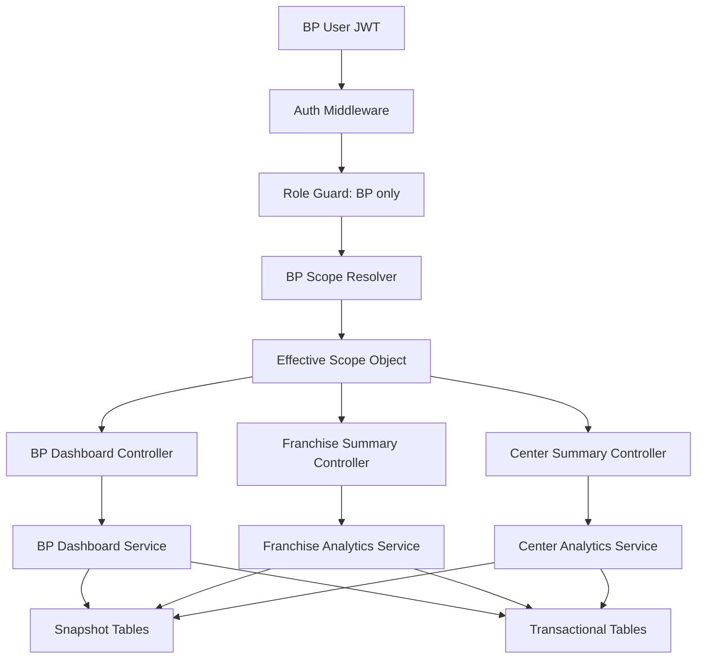
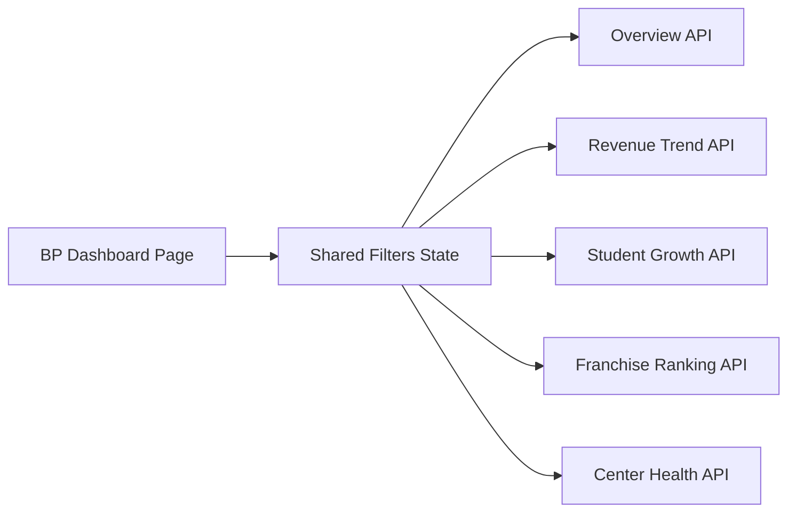

# BP Phase 1 Foundation Blueprint

This document defines the Phase 1 redesign for the BUSINESS_PARTNER module in the Abacus Education Management Platform.

Scope is intentionally limited to:

- BP scope system
- BP dashboard foundation
- franchise analytics summary
- center analytics summary
- role isolation cleanup
- performance-safe KPI APIs

Out of scope for Phase 1:

- AI prediction and recommendations
- advanced finance and settlement redesign
- full ERP reporting suite
- unrelated role/module redesign

---

## 1. Phase 1 Architecture

### Current State In Repo

The current codebase already has:

- `BusinessPartner` in Prisma
- ownership from `FranchiseProfile.businessPartnerId`
- BP hierarchy scoping via `src/middleware/partner-scope.js`
- a broad `/partner/dashboard` endpoint in `src/controllers/partner.controller.js`
- a BP frontend dashboard at `frontend/src/modules/businessPartner/BusinessPartnerDashboardPage.jsx`

Current issues:

- BP scope is inferred mainly from hierarchy nodes, not explicit portfolio assignments.
- BP dashboard mixes multiple concerns into one payload.
- role capability flags are broad and not resource-based.
- KPI APIs are not yet split into summary-oriented, cacheable read models.
- future direct-center ownership is not explicit.

### Phase 1 Target

Phase 1 should keep the existing `BusinessPartner` root model and existing franchise ownership, then add explicit scope tables and dedicated dashboard read APIs.

Design principle:

- keep one monolith
- keep Prisma + Express
- add explicit BP scope resolution
- build read-optimized KPI endpoints
- isolate BP data at middleware + service + query layers

### Phase 1 Architecture Diagram



### Effective Scope Model

BP should see:

- explicitly assigned franchises
- centers under those franchises
- directly assigned centers
- teachers and students within that effective center scope

Effective scope formula:

$$
EffectiveCenterScope = DirectCenterAssignments \cup CentersFromAssignedFranchises
$$

$$
EffectiveFranchiseScope = AssignedFranchises
$$

The request scope should resolve once and attach to `req.bpScope`.

Suggested request shape:

```js
req.bpScope = {
  businessPartnerId,
  franchiseIds: [...],
  centerIds: [...],
  teacherUserIds: [...],
  hierarchyNodeIds: [...],
  source: {
    directFranchiseIds: [...],
    directCenterIds: [...]
  }
};
```

### Resource Ownership Rules

- `FranchiseProfile` is in BP scope when its id is in `BusinessPartnerFranchise` or when legacy ownership fallback matches `FranchiseProfile.businessPartnerId`.
- `CenterProfile` is in BP scope when:
  - its `franchiseProfileId` belongs to an allowed franchise, or
  - its id is in `BusinessPartnerCenterScope`.
- `Teacher`, `Student`, `Enrollment`, `Attendance`, and fee records are in scope only if they belong to allowed centers or hierarchy nodes derived from allowed centers.

### Phase 1 Module Boundaries

- `bp-scope`: resolves allowed franchises and centers.
- `bp-dashboard`: executive KPIs and chart feeds.
- `bp-analytics`: franchise and center summary queries.
- `bp-policy`: route/resource authorization helpers.
- `bp-snapshots`: optional daily aggregate jobs.

---

## 2. Prisma Schema Changes

### Keep Existing Models

Retain these existing models and relations:

- `BusinessPartner`
- `FranchiseProfile.businessPartnerId`
- `CenterProfile.franchiseProfileId`

### Add Explicit BP Scope Tables

These tables solve direct scope assignment and remove over-reliance on hierarchy inference.

```prisma
model BusinessPartnerFranchise {
  id                String   @id @default(cuid())
  tenantId          String
  businessPartnerId String
  franchiseProfileId String
  isActive          Boolean  @default(true)
  effectiveFrom     DateTime @default(now())
  effectiveTo       DateTime?
  createdAt         DateTime @default(now())
  updatedAt         DateTime @updatedAt

  tenant            Tenant           @relation(fields: [tenantId], references: [id], onDelete: Restrict)
  businessPartner   BusinessPartner  @relation(fields: [businessPartnerId], references: [id], onDelete: Cascade)
  franchiseProfile  FranchiseProfile @relation(fields: [franchiseProfileId], references: [id], onDelete: Cascade)

  @@unique([businessPartnerId, franchiseProfileId])
  @@index([tenantId, businessPartnerId, isActive])
  @@index([tenantId, franchiseProfileId, isActive])
  @@map("businesspartnerfranchise")
}

model BusinessPartnerCenterScope {
  id                String   @id @default(cuid())
  tenantId          String
  businessPartnerId String
  centerProfileId   String
  scopeType         BusinessPartnerCenterScopeType @default(DIRECT)
  isActive          Boolean  @default(true)
  effectiveFrom     DateTime @default(now())
  effectiveTo       DateTime?
  createdAt         DateTime @default(now())
  updatedAt         DateTime @updatedAt

  tenant            Tenant          @relation(fields: [tenantId], references: [id], onDelete: Restrict)
  businessPartner   BusinessPartner @relation(fields: [businessPartnerId], references: [id], onDelete: Cascade)
  centerProfile     CenterProfile   @relation(fields: [centerProfileId], references: [id], onDelete: Cascade)

  @@unique([businessPartnerId, centerProfileId])
  @@index([tenantId, businessPartnerId, isActive])
  @@index([tenantId, centerProfileId, isActive])
  @@map("businesspartnercenterscope")
}

enum BusinessPartnerCenterScopeType {
  DIRECT
  OVERRIDE
}
```

### Add Snapshot Table For Safe KPIs

Phase 1 should avoid deep live aggregation for every dashboard load.

```prisma
model BusinessPartnerDailySnapshot {
  id                    String   @id @default(cuid())
  tenantId              String
  businessPartnerId     String
  snapshotDate          DateTime
  totalStudents         Int      @default(0)
  activeStudents        Int      @default(0)
  totalFranchises       Int      @default(0)
  activeCenters         Int      @default(0)
  monthlyCollections    Decimal  @default(0) @db.Decimal(12, 2)
  pendingFees           Decimal  @default(0) @db.Decimal(12, 2)
  newAdmissions         Int      @default(0)
  studentGrowthPercent  Decimal  @default(0) @db.Decimal(8, 2)
  createdAt             DateTime @default(now())
  updatedAt             DateTime @updatedAt

  tenant            Tenant          @relation(fields: [tenantId], references: [id], onDelete: Restrict)
  businessPartner   BusinessPartner @relation(fields: [businessPartnerId], references: [id], onDelete: Cascade)

  @@unique([businessPartnerId, snapshotDate])
  @@index([tenantId, businessPartnerId, snapshotDate])
  @@map("businesspartnerdailysnapshot")
}
```

### Add Franchise And Center Summary Snapshots

```prisma
model FranchiseAnalyticsSnapshot {
  id                   String   @id @default(cuid())
  tenantId             String
  businessPartnerId    String
  franchiseProfileId   String
  snapshotDate         DateTime
  studentCount         Int      @default(0)
  activeStudents       Int      @default(0)
  monthlyCollections   Decimal  @default(0) @db.Decimal(12, 2)
  pendingFees          Decimal  @default(0) @db.Decimal(12, 2)
  centerCount          Int      @default(0)
  teacherCount         Int      @default(0)
  growthPercent        Decimal  @default(0) @db.Decimal(8, 2)
  healthScore          Decimal  @default(0) @db.Decimal(8, 2)
  createdAt            DateTime @default(now())
  updatedAt            DateTime @updatedAt

  @@unique([franchiseProfileId, snapshotDate])
  @@index([tenantId, businessPartnerId, snapshotDate])
  @@index([tenantId, franchiseProfileId, snapshotDate])
  @@map("franchiseanalyticssnapshot")
}

model CenterAnalyticsSnapshot {
  id                   String   @id @default(cuid())
  tenantId             String
  businessPartnerId    String
  franchiseProfileId   String
  centerProfileId      String
  snapshotDate         DateTime
  activeStudents       Int      @default(0)
  attendancePercent    Decimal  @default(0) @db.Decimal(8, 2)
  monthlyRevenue       Decimal  @default(0) @db.Decimal(12, 2)
  pendingFees          Decimal  @default(0) @db.Decimal(12, 2)
  teacherCount         Int      @default(0)
  studentGrowthPercent Decimal  @default(0) @db.Decimal(8, 2)
  retentionPercent     Decimal  @default(0) @db.Decimal(8, 2)
  healthScore          Decimal  @default(0) @db.Decimal(8, 2)
  createdAt            DateTime @default(now())
  updatedAt            DateTime @updatedAt

  @@unique([centerProfileId, snapshotDate])
  @@index([tenantId, businessPartnerId, snapshotDate])
  @@index([tenantId, franchiseProfileId, snapshotDate])
  @@index([tenantId, centerProfileId, snapshotDate])
  @@map("centeranalyticssnapshot")
}
```

### BusinessPartner Model Extensions

Add back-relations only:

```prisma
franchiseScopes      BusinessPartnerFranchise[]
centerScopes         BusinessPartnerCenterScope[]
dailySnapshots       BusinessPartnerDailySnapshot[]
franchiseSnapshots   FranchiseAnalyticsSnapshot[]
centerSnapshots      CenterAnalyticsSnapshot[]
```

### Migration Strategy

Phase 1 migration order:

1. add explicit scope tables
2. add snapshot tables
3. backfill `BusinessPartnerFranchise` from `FranchiseProfile.businessPartnerId`
4. leave `FranchiseProfile.businessPartnerId` in place during transition
5. switch scope resolver to use explicit tables first and legacy field as fallback

---

## 3. Backend Structure

### Suggested Structure

```text
src/
  controllers/
    bp-dashboard.controller.js
    bp-franchise-analytics.controller.js
    bp-center-analytics.controller.js
  services/
    bp-scope.service.js
    bp-dashboard.service.js
    bp-franchise-analytics.service.js
    bp-center-analytics.service.js
    bp-snapshot.service.js
  middleware/
    bp-scope.js
    bp-policy.js
  routes/
    bp-dashboard.routes.js
    bp-analytics.routes.js
  jobs/
    bp-daily-snapshot.job.js
```

### Design Rules

- controllers only parse filters and return response DTOs
- services own all query logic
- middleware resolves scope and enforces role
- no controller should manually derive BP scope
- all Prisma filters must be built from `req.bpScope`

### Scope Service

`bp-scope.service.js`

Responsibilities:

- resolve BP record from JWT user
- load explicit franchise scope
- load explicit center scope
- derive center scope from allowed franchises
- resolve hierarchy node ids from allowed centers
- expose reusable filter builders

Example contract:

```js
async function resolveBusinessPartnerScope({ tenantId, userId }) {
  return {
    businessPartnerId,
    franchiseIds,
    centerIds,
    hierarchyNodeIds
  };
}

function buildBpStudentWhere({ tenantId, bpScope }) {
  return {
    tenantId,
    hierarchyNodeId: { in: bpScope.hierarchyNodeIds }
  };
}
```

### Dashboard Service

`bp-dashboard.service.js`

Responsibilities:

- overview KPI query
- revenue trend query
- student growth trend query
- franchise ranking query
- center health overview query

Return a dashboard DTO shaped for frontend use instead of exposing raw Prisma shapes.

### Franchise Analytics Service

`bp-franchise-analytics.service.js`

Responsibilities:

- paginated franchise summaries
- one-franchise summary drilldown
- ranking and trend aggregation

### Center Analytics Service

`bp-center-analytics.service.js`

Responsibilities:

- paginated center summaries
- center health calculations
- attendance and growth rollups

### Snapshot Job

`bp-daily-snapshot.job.js`

Responsibilities:

- compute daily BP, franchise, and center summaries
- store snapshot rows for current day
- support rebuild for a date range

For Phase 1 this can run nightly plus an on-demand admin script.

---

## 4. Middleware & Security

### Current Gap

Current `src/middleware/rbac.js` is role-only. Current `src/utils/capabilities.js` is capability-flag oriented but not resource scoped. Phase 1 should add BP-specific policy guards without redesigning all auth.

### Recommended Middleware Stack For BP Routes

```js
router.use(requireRole("BP"));
router.use(requireBusinessPartnerScope);
```

Then optionally per route:

```js
router.get("/dashboard/overview", requireBpPermission("dashboard.read"), getBpDashboardOverview);
```

### New `requireBusinessPartnerScope`

Keep the existing middleware file path but change internals to explicit scope-first resolution.

Resolution order:

1. resolve `BusinessPartner` from current user
2. load `BusinessPartnerFranchise`
3. load `BusinessPartnerCenterScope`
4. derive effective center ids from franchises plus direct centers
5. derive hierarchy nodes from centers
6. attach resolved ids to `req.bpScope`
7. if scope is empty, attach sentinel empty arrays and deny resource access safely

### New Policy Layer

`src/middleware/bp-policy.js`

```js
function requireBpPermission(permission) {
  return (req, res, next) => {
    const allowed = {
      "dashboard.read": true,
      "analytics.read": true,
      "franchise.read": true,
      "center.read": true
    };

    if (!allowed[permission]) {
      return res.apiError(403, "Forbidden", "BP_PERMISSION_DENIED");
    }
    return next();
  };
}
```

Phase 1 can keep permissions simple. The important part is resource-safe scope.

### Query Safety Rules

Every BP query must include:

- `tenantId`
- allowed `franchiseIds` or `centerIds` or `hierarchyNodeIds`

Never accept client-supplied franchise or center ids directly. Always intersect them with scope.

Safe filter example:

```js
const requestedFranchiseId = req.query.franchiseId || null;
const franchiseIds = requestedFranchiseId
  ? req.bpScope.franchiseIds.filter((id) => id === requestedFranchiseId)
  : req.bpScope.franchiseIds;
```

### Route Protection Examples

```js
router.get(
  "/dashboard/overview",
  requireRole("BP"),
  requireBusinessPartnerScope,
  requireBpPermission("dashboard.read"),
  getBpDashboardOverview
);
```

```js
router.get(
  "/analytics/franchises",
  requireRole("BP"),
  requireBusinessPartnerScope,
  requireBpPermission("analytics.read"),
  listBpFranchiseSummaries
);
```

---

## 5. Dashboard API Design

Phase 1 should replace the broad `/partner/dashboard` payload with smaller, cacheable BP-specific endpoints.

### Endpoints

```text
GET /bp/dashboard/overview
GET /bp/dashboard/revenue-trend
GET /bp/dashboard/student-growth-trend
GET /bp/dashboard/franchise-ranking
GET /bp/dashboard/center-health-overview
GET /bp/analytics/franchises
GET /bp/analytics/centers
```

You may keep `/partner/dashboard` temporarily as a compatibility wrapper, but new frontend work should move to `/bp/*` endpoints.

### `GET /bp/dashboard/overview`

Returns KPI cards only.

Response shape:

```json
{
  "meta": {
    "businessPartnerId": "bp_123",
    "generatedAt": "2026-05-09T10:00:00.000Z",
    "period": {
      "from": "2026-05-01",
      "to": "2026-05-31"
    }
  },
  "kpis": {
    "totalStudents": 1240,
    "activeStudents": 1162,
    "totalFranchises": 8,
    "activeCenters": 34,
    "monthlyCollections": 1825000,
    "pendingFees": 212000,
    "newAdmissions": 84,
    "studentGrowthPercent": 6.4
  }
}
```

### `GET /bp/dashboard/revenue-trend`

```json
{
  "series": [
    { "label": "Jan", "value": 1540000 },
    { "label": "Feb", "value": 1680000 }
  ]
}
```

### `GET /bp/dashboard/student-growth-trend`

```json
{
  "series": [
    { "label": "Jan", "activeStudents": 1012, "newAdmissions": 52 },
    { "label": "Feb", "activeStudents": 1044, "newAdmissions": 67 }
  ]
}
```

### `GET /bp/dashboard/franchise-ranking`

```json
{
  "items": [
    {
      "franchiseId": "fr_1",
      "name": "North Region",
      "studentCount": 420,
      "monthlyCollections": 420000,
      "growthPercent": 8.5,
      "healthScore": 81.4
    }
  ]
}
```

### `GET /bp/dashboard/center-health-overview`

```json
{
  "items": [
    {
      "centerId": "c_1",
      "name": "Center A",
      "attendancePercent": 87.2,
      "studentGrowthPercent": 5.1,
      "retentionPercent": 90.4,
      "healthScore": 79.8
    }
  ]
}
```

### Filter Contract

Supported Phase 1 filters:

- `fromDate`
- `toDate`
- `franchiseId`
- `centerId`
- `groupBy=month`

Rules:

- if omitted, use current month for KPIs
- `franchiseId` and `centerId` must be intersected with `req.bpScope`
- no arbitrary free-form reporting filters in Phase 1

### Caching Recommendation

- dashboard overview: 60 to 180 seconds
- trend endpoints: 5 to 15 minutes
- rankings: 5 minutes
- snapshots reduce need for live cache misses

---

## 6. Franchise Analytics Logic

### Required Output

Each franchise summary returns:

- student count
- active students
- monthly collections
- pending fees
- center count
- teacher count
- growth percentage
- health score

### Data Strategy

Phase 1 preferred source:

- `FranchiseAnalyticsSnapshot` for primary list endpoint

Fallback if snapshot missing:

- aggregate live from scoped center ids under that franchise

### Calculation Logic

Student count:

$$
StudentCount = \text{all students in franchise centers}
$$

Active students:

$$
ActiveStudents = \text{students where isActive = true in franchise centers}
$$

Growth percent:

$$
GrowthPercent = \frac{CurrentActiveStudents - PreviousActiveStudents}{\max(PreviousActiveStudents, 1)} \times 100
$$

Suggested health score:

$$
HealthScore = 0.35 \times CollectionScore + 0.25 \times GrowthScore + 0.20 \times StudentActivityScore + 0.20 \times TeacherCoverageScore
$$

Normalize each sub-score to 0 to 100.

### Query Pattern

- get allowed franchise ids from `req.bpScope`
- read snapshots by franchise ids and latest snapshot date
- paginate at DB level
- join only lightweight profile info

Suggested service contract:

```js
async function listBpFranchiseSummaries({ tenantId, bpScope, filters, pagination })
```

### Response DTO

```json
{
  "items": [
    {
      "franchiseId": "fr_1",
      "franchiseCode": "FR001",
      "franchiseName": "North Region",
      "studentCount": 320,
      "activeStudents": 301,
      "monthlyCollections": 425000,
      "pendingFees": 52000,
      "centerCount": 6,
      "teacherCount": 18,
      "growthPercent": 7.2,
      "healthScore": 80.5
    }
  ],
  "total": 8
}
```

---

## 7. Center Analytics Logic

### Required Output

Each center summary returns:

- active students
- attendance percent
- monthly revenue
- pending fees
- teacher count
- student growth
- health score

### Health Score Formula

Per requirement:

$$
HealthScore = CollectionScore + GrowthScore + AttendanceScore + RetentionScore
$$

For implementation, convert to weighted 0 to 100 output:

$$
HealthScore = 0.30 \times CollectionScore + 0.25 \times GrowthScore + 0.25 \times AttendanceScore + 0.20 \times RetentionScore
$$

### Supporting Metrics

Attendance percent:

$$
AttendancePercent = \frac{PresentSessions}{MarkedSessions} \times 100
$$

Student growth percent:

$$
StudentGrowthPercent = \frac{CurrentActiveStudents - PreviousActiveStudents}{\max(PreviousActiveStudents, 1)} \times 100
$$

Retention percent:

$$
RetentionPercent = \frac{RetainedStudents}{StudentsAtPeriodStart} \times 100
$$

Monthly revenue:

- use collected fee transactions posted in month
- do not use billed-only amount in Phase 1 KPI tiles

### Query Pattern

- resolve allowed center ids from `req.bpScope`
- filter optional franchise id through allowed scope
- return latest `CenterAnalyticsSnapshot` rows

Suggested service contract:

```js
async function listBpCenterSummaries({ tenantId, bpScope, filters, pagination })
```

### Response DTO

```json
{
  "items": [
    {
      "centerId": "center_1",
      "centerCode": "C001",
      "centerName": "Main Center",
      "activeStudents": 94,
      "attendancePercent": 88.6,
      "monthlyRevenue": 148000,
      "pendingFees": 12000,
      "teacherCount": 5,
      "studentGrowthPercent": 4.8,
      "retentionPercent": 92.1,
      "healthScore": 82.4
    }
  ],
  "total": 34
}
```

---

## 8. Frontend Structure

### Current State In Repo

Current BP frontend lives under `frontend/src/modules/businessPartner` and uses a single `getPartnerDashboard()` call.

Phase 1 should keep the route namespace but reorganize around dashboard-focused services and widgets.

### Suggested Structure

```text
frontend/src/modules/businessPartner/
  dashboard/
    pages/
      BusinessPartnerDashboardPage.jsx
    components/
      BpKpiGrid.jsx
      BpRevenueTrendChart.jsx
      BpStudentGrowthChart.jsx
      BpFranchiseRankingCard.jsx
      BpCenterHealthCard.jsx
      BpDashboardFilters.jsx
    hooks/
      useBpDashboardOverview.js
      useBpRevenueTrend.js
      useBpStudentGrowthTrend.js
    services/
      bpDashboardService.js
      bpAnalyticsService.js
  analytics/
    pages/
      BusinessPartnerFranchiseAnalyticsPage.jsx
      BusinessPartnerCenterAnalyticsPage.jsx
```

### Frontend Data Flow



### Dashboard Layout Plan

Top row:

- Total Students
- Active Students
- Total Franchises
- Active Centers
- Monthly Collections
- Pending Fees
- New Admissions
- Student Growth %

Second row:

- Monthly Revenue Trend
- Student Growth Trend

Third row:

- Franchise Ranking
- Center Health Overview

Filter bar:

- date range
- franchise selector
- center selector

### Tailwind Layout Example

```jsx
<section className="space-y-6">
  <BpDashboardFilters />
  <div className="grid gap-4 sm:grid-cols-2 xl:grid-cols-4">
    <KpiCard />
  </div>
  <div className="grid gap-6 xl:grid-cols-2">
    <BpRevenueTrendChart />
    <BpStudentGrowthChart />
  </div>
  <div className="grid gap-6 xl:grid-cols-2">
    <BpFranchiseRankingCard />
    <BpCenterHealthCard />
  </div>
</section>
```

### Frontend Service API

```js
getBpDashboardOverview(filters)
getBpRevenueTrend(filters)
getBpStudentGrowthTrend(filters)
getBpFranchiseRanking(filters)
listBpFranchiseAnalytics(filters)
listBpCenterAnalytics(filters)
```

### Frontend Cleanup Rule

- stop growing `partnerService.js` for new dashboard-specific APIs
- create BP-specific dashboard and analytics service files
- keep existing routes stable for now

---

## 9. Performance Optimization

### Phase 1 Practical Strategy

Do not run all KPIs live from base tables on every request.

Use a hybrid strategy:

- live query for narrow current-period counts only when cheap
- snapshot tables for ranking, trend, and health calculations
- short TTL cache for overview cards

### Recommended Snapshot Coverage

- `BusinessPartnerDailySnapshot`
- `FranchiseAnalyticsSnapshot`
- `CenterAnalyticsSnapshot`

### Cache Strategy

- application cache or Redis if already available
- keys include tenant + bp + filter tuple

Examples:

- `bp:overview:{tenantId}:{bpId}:{month}`
- `bp:revenue-trend:{tenantId}:{bpId}:{from}:{to}:{franchiseId}`

### Query Safety And Speed

Add indexes for Phase 1 hot paths.

Recommended indexes:

- `BusinessPartnerFranchise(tenantId, businessPartnerId, isActive)`
- `BusinessPartnerCenterScope(tenantId, businessPartnerId, isActive)`
- `FranchiseProfile(tenantId, businessPartnerId, status, isActive)`
- `CenterProfile(tenantId, franchiseProfileId, status, isActive)`
- `Student(tenantId, hierarchyNodeId, isActive)`
- fee transaction tables by `tenantId`, `centerId`, `postedAt`
- attendance tables by `tenantId`, `centerId`, `sessionDate`

### API Load Optimization

- split dashboard APIs instead of one huge payload
- parallelize requests from frontend
- cache chart endpoints more aggressively than KPI endpoints
- paginate franchise and center summary pages

### Async Jobs

Phase 1 only needs one background job class:

- nightly snapshot refresh

Optional later:

- hourly refresh for high-traffic environments

---

## 10. Step-by-Step Implementation Plan

### Step 1: Schema Foundation

- add `BusinessPartnerFranchise`
- add `BusinessPartnerCenterScope`
- add snapshot tables
- add indexes

### Step 2: Backfill And Migration Safety

- populate `BusinessPartnerFranchise` from existing `FranchiseProfile.businessPartnerId`
- leave legacy field in place
- do not remove hierarchy-based fallback yet

### Step 3: Scope Service

- create `bp-scope.service.js`
- resolve effective franchise ids and center ids
- expose reusable query helpers

### Step 4: Middleware Upgrade

- refactor `src/middleware/partner-scope.js` to explicit scope-first resolution
- keep `req.bpScope` contract stable where possible
- ensure empty scope never falls back to tenant-wide data

### Step 5: New Dashboard Services

- add `bp-dashboard.service.js`
- add `bp-franchise-analytics.service.js`
- add `bp-center-analytics.service.js`
- move query logic out of `partner.controller.js`

### Step 6: Add New APIs

- add `/bp/dashboard/overview`
- add `/bp/dashboard/revenue-trend`
- add `/bp/dashboard/student-growth-trend`
- add `/bp/dashboard/franchise-ranking`
- add `/bp/dashboard/center-health-overview`
- add `/bp/analytics/franchises`
- add `/bp/analytics/centers`

### Step 7: Snapshot Job

- create daily snapshot job
- support backfill for last 90 days
- use snapshots as primary source where available

### Step 8: Frontend Refactor

- create `dashboard/services` and `dashboard/components`
- migrate BP dashboard page from monolithic response to dedicated hooks
- preserve route `/bp/dashboard`

### Step 9: Franchise And Center Analytics Pages

- build paginated summary tables
- add health score badges
- add period filter and franchise filter

### Step 10: Security Review

- verify all new BP endpoints require BP role and scope middleware
- verify all query filters use scope intersection
- test unrelated franchise and center ids return empty or forbidden results

### Step 11: Performance Review

- benchmark overview endpoint
- benchmark franchise summary endpoint at 100 centers
- confirm snapshot queries stay index-backed

### Step 12: Deprecation Path

- keep existing `/partner/dashboard` temporarily
- convert dashboard UI to new `/bp/*` endpoints
- deprecate broad old dashboard payload after frontend switch

---

## Recommended Phase 1 Outcome

After Phase 1, the BP module should have:

- explicit BP franchise and center ownership
- reusable BP scope middleware
- isolated BP-safe APIs
- fast KPI endpoints
- franchise and center summary analytics
- a cleaner BP frontend dashboard structure

This is enough to turn BP into a real business management role without pulling the platform into premature enterprise complexity.