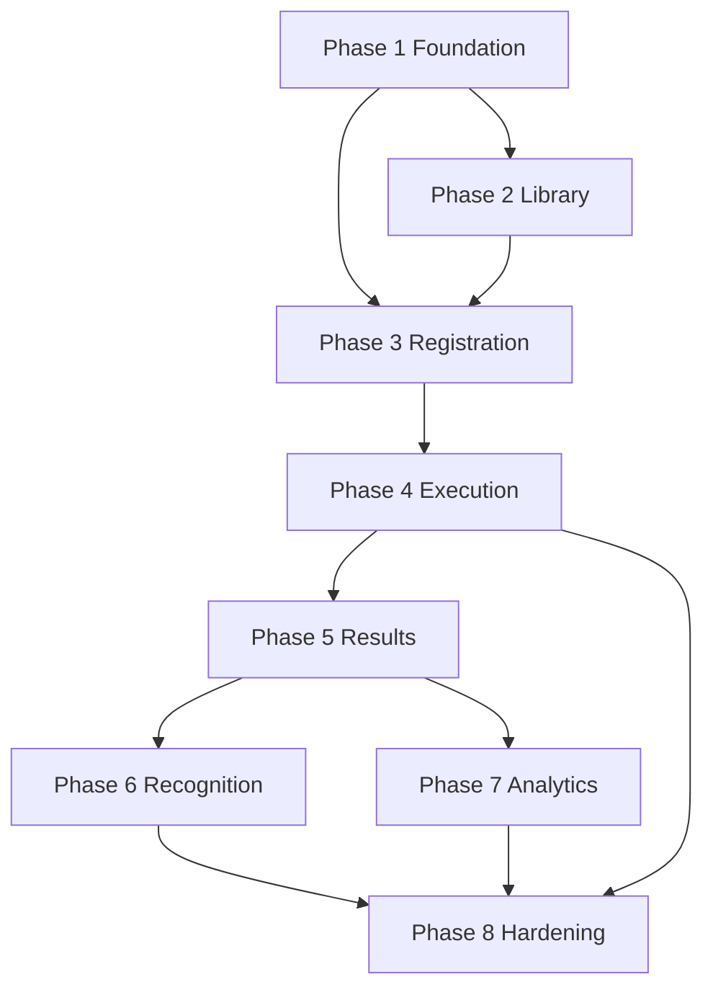

# Competition 2.0 Implementation Roadmap

Status: approved implementation plan aligned to the finalized Competition 2.0 architecture package and the existing competition baseline in this repository.

## 1. Roadmap Principles

This roadmap is intentionally execution-oriented and does not redesign the approved architecture. It assumes the finalized architecture baseline, business process, logical database design, backend service boundaries, frontend module structure, and screen catalog are the source of truth.

Guiding principles:

- Preserve the existing ERP and current competition module during transition.
- Deliver each phase as an independently deployable slice.
- Use feature flags to avoid breaking existing users.
- Keep new competition capabilities behind role-aware access and scope-safe APIs.
- Prefer additive changes over disruptive rewrites.
- Reuse shared enterprise services for auth, scope, notification, audit, and reporting.

---

## 2. Phase Summary

| Phase | Focus | Suggested complexity | Primary outcome |
| --- | --- | --- | --- |
| Phase 1 | Competition Foundation | Medium | Establish the new competition domain foundation behind a flag |
| Phase 2 | Competition Library | Medium | Introduce content and competition structure assets |
| Phase 3 | Registration | High | Enable participant registration and eligibility handling |
| Phase 4 | Competition Execution | High | Support live competition operations and session workflows |
| Phase 5 | Results | Medium | Publish results and expose ranking behavior |
| Phase 6 | Recognition | Medium | Enable awards, certificates, badges, and recognition workflows |
| Phase 7 | Analytics & Reports | Medium | Deliver dashboards, exports, and stakeholder reporting |
| Phase 8 | Audit, Performance & Hardening | Medium | Stabilize, harden, and retire legacy behavior safely |

---

## 3. Phase-by-Phase Roadmap

### Phase 1 — Competition Foundation

- Goal: Establish the new competition domain foundation without changing the live behavior of the existing module.
- Business value: Gives the organization a first-class competition domain that can evolve independently while preserving existing ERP stability.
- Modules included:
  - competition domain foundation
  - governance and lifecycle configuration
  - visibility and scope rules
  - initial admin and operational screens
- Database changes:
  - New Prisma models: Competition, CompetitionTemplate, CompetitionSeason, CompetitionStageConfig, CompetitionVisibilityRule
  - Modified existing models: BusinessPartner, FranchiseProfile, CenterProfile, Teacher, Student, Worksheet, Enrollment
- Backend services:
  - CompetitionFoundationService
  - CompetitionGovernanceService
  - CompetitionScopeService
  - CompetitionConfigurationService
- API groups:
  - foundation metadata APIs
  - competition lifecycle APIs
  - governance and visibility APIs
- Frontend screens:
  - competition admin landing page
  - competition create/edit foundation screen
  - competition setup and configuration screen
- RBAC impact:
  - add new permissions for competition setup and governance
  - keep legacy access rules intact until phase rollout is complete
- Testing strategy:
  - unit tests for lifecycle state transitions
  - integration tests for scope resolution
  - RBAC tests for role-restricted setup screens
  - UI tests for creation and edit flows
- Migration strategy:
  - deploy new foundation behind feature flag
  - keep legacy module active as default
  - seed baseline reference data for templates and stage configuration
- Dependencies:
  - shared auth, scope, notification, and audit infrastructure
- Estimated complexity: Medium
- Acceptance criteria:
  - new competition foundation can be created and configured without affecting legacy competition flows
  - lifecycle states and visibility rules are stored and retrievable
  - feature flag enables and disables the new foundation safely
- New Prisma models: Competition, CompetitionTemplate, CompetitionSeason, CompetitionStageConfig, CompetitionVisibilityRule
- Modified existing models: BusinessPartner, FranchiseProfile, CenterProfile, Teacher, Student, Worksheet, Enrollment
- New backend services: CompetitionFoundationService, CompetitionGovernanceService, CompetitionScopeService, CompetitionConfigurationService
- New API groups: foundation, lifecycle, governance, visibility
- New frontend modules: competition setup workspace, configuration panel
- Background jobs: none initially; optional reference-data sync jobs
- Notifications: setup confirmation, governance assignment notices
- Audit events: competition created, configuration updated, visibility rule changed
- Permissions: create competition, edit competition, manage competition configuration, view competition setup
- Feature flags: competition-v2-foundation
- Regression risks: conflicting legacy and new competition records, inconsistent visibility behavior
- Rollback strategy: disable feature flag and leave legacy workflow untouched

### Phase 2 — Competition Library

- Goal: Introduce the reusable content and structure layer for competitions.
- Business value: Enables standardized competition formats, content packaging, and reusable subject/round definitions without hard-coding them into each event.
- Modules included:
  - competition library
  - format and round definitions
  - content package and worksheet associations
  - reusable competition assets
- Database changes:
  - New Prisma models: CompetitionLibraryItem, CompetitionFormat, CompetitionRoundDefinition, CompetitionContentPackage, CompetitionAssetLink
  - Modified existing models: Worksheet, Level, Subject, Course, BusinessPartner
- Backend services:
  - CompetitionLibraryService
  - CompetitionContentService
  - CompetitionTemplateService
- API groups:
  - library browse and detail APIs
  - asset and content association APIs
  - format and round definition APIs
- Frontend screens:
  - library management screen
  - format/round management screen
  - content package screen
- RBAC impact:
  - add library maintenance permissions for content authors and competition admins
- Testing strategy:
  - unit tests for content association rules
  - integration tests for library consumption by competition setup
  - UI tests for library browse and manage flows
- Migration strategy:
  - seed library data from existing competition metadata where applicable
  - keep old competition worksheet linkage intact during rollout
- Dependencies:
  - Phase 1 foundation must be deployed first
- Estimated complexity: Medium
- Acceptance criteria:
  - competition formats and content packages can be created and reused across competitions
  - existing competition content remains visible and usable
- New Prisma models: CompetitionLibraryItem, CompetitionFormat, CompetitionRoundDefinition, CompetitionContentPackage, CompetitionAssetLink
- Modified existing models: Worksheet, Level, Subject, Course, BusinessPartner
- New backend services: CompetitionLibraryService, CompetitionContentService, CompetitionTemplateService
- New API groups: library, content, format, round-definition
- New frontend modules: library workspace, content package workspace
- Background jobs: library index refresh or cache warm-up
- Notifications: library approval or publish notices
- Audit events: library item created, edited, published, unpublished
- Permissions: manage competition library, manage content packages, publish library items
- Feature flags: competition-v2-library
- Regression risks: legacy content references break if associations are not preserved
- Rollback strategy: disable the library feature flag and keep existing competition content intact

### Phase 3 — Registration

- Goal: Enable registration and participation workflows for competitions.
- Business value: Allows schools, centers, teachers, and students to participate in a controlled and auditable registration process.
- Modules included:
  - registration window management
  - eligibility and capacity rules
  - participant registration
  - waitlist handling
- Database changes:
  - New Prisma models: CompetitionRegistrationWindow, CompetitionRegistration, CompetitionEligibilityRule, CompetitionWaitlistEntry, CompetitionCapacitySnapshot
  - Modified existing models: Student, Enrollment, CenterProfile, Teacher
- Backend services:
  - CompetitionRegistrationService
  - CompetitionEligibilityService
  - CompetitionCapacityService
  - CompetitionWaitlistService
- API groups:
  - registration window APIs
  - participant registration APIs
  - eligibility and capacity APIs
- Frontend screens:
  - registration setup screen
  - participant registration screen
  - center/teacher registration dashboard
- RBAC impact:
  - add registration and participant permissions for centers, teachers, and admins
  - preserve legacy enrollment access during transition
- Testing strategy:
  - unit tests for eligibility and capacity rules
  - integration tests for registration window lifecycle
  - workflow tests for registration approval and waitlist behavior
  - RBAC tests for role-based registration access
- Migration strategy:
  - expose registration only to pilot roles first
  - maintain legacy enrollment flows as fallback until parity is proven
- Dependencies:
  - Phase 1 foundation and Phase 2 library must be live
- Estimated complexity: High
- Acceptance criteria:
  - registrations can be created, validated, and tracked through the approved lifecycle
  - capacity and waitlist behavior match the approved rules
  - registration operations do not impact legacy competition usage
- New Prisma models: CompetitionRegistrationWindow, CompetitionRegistration, CompetitionEligibilityRule, CompetitionWaitlistEntry, CompetitionCapacitySnapshot
- Modified existing models: Student, Enrollment, CenterProfile, Teacher
- New backend services: CompetitionRegistrationService, CompetitionEligibilityService, CompetitionCapacityService, CompetitionWaitlistService
- New API groups: registration-window, registration, eligibility, waitlist
- New frontend modules: registration workspace, participant management screen
- Background jobs: registration close/open processing, capacity recalculation
- Notifications: registration confirmation, eligibility failure, waitlist movement, deadline reminders
- Audit events: registration created, updated, cancelled, waitlisted, approved
- Permissions: manage registration windows, register participants, view registration reports, manage waitlist
- Feature flags: competition-v2-registration
- Regression risks: conflicts with legacy enrollment records and duplicate-participant handling
- Rollback strategy: disable registration feature flag and keep legacy enrollment route active

### Phase 4 — Competition Execution

- Goal: Support live competition operations during execution and event handling.
- Business value: Enables the operational running of competitions, including session scheduling, event control, and participant readiness tracking.
- Modules included:
  - execution orchestration
  - session and round handling
  - participant readiness and status tracking
  - operational monitoring
- Database changes:
  - New Prisma models: CompetitionSession, CompetitionRoundExecution, CompetitionParticipantStatus, CompetitionExecutionLog
  - Modified existing models: Competition, CompetitionRegistration, Teacher, CenterProfile
- Backend services:
  - CompetitionExecutionService
  - CompetitionSessionService
  - CompetitionStatusService
  - CompetitionOperationsService
- API groups:
  - session management APIs
  - execution status APIs
  - operational monitoring APIs
- Frontend screens:
  - live competition operations dashboard
  - session management screen
  - participant status screen
- RBAC impact:
  - add operational permissions for admins, teachers, and event coordinators
- Testing strategy:
  - workflow tests for round/session progression
  - integration tests for operational state updates
  - UI tests for live dashboard and session screens
- Migration strategy:
  - expose execution screens to pilot operational roles first
  - keep legacy competition operations available until execution parity is validated
- Dependencies:
  - Phase 1, 2, and 3 must be in place
- Estimated complexity: High
- Acceptance criteria:
  - sessions and rounds can be created and managed without breaking registration workflows
  - execution status is visible and auditable across roles
- New Prisma models: CompetitionSession, CompetitionRoundExecution, CompetitionParticipantStatus, CompetitionExecutionLog
- Modified existing models: Competition, CompetitionRegistration, Teacher, CenterProfile
- New backend services: CompetitionExecutionService, CompetitionSessionService, CompetitionStatusService, CompetitionOperationsService
- New API groups: session, execution-status, operations
- New frontend modules: operations dashboard, session control screen
- Background jobs: session state transitions, event reminders, stale operation cleanup
- Notifications: session started, session paused, participant status change, operational alerts
- Audit events: session created, session updated, execution status changed, operational override logged
- Permissions: manage sessions, view execution dashboard, update participant status, control round progression
- Feature flags: competition-v2-execution
- Regression risks: operational state drift between legacy and new modules
- Rollback strategy: disable execution flag and retain read-only visibility for prior competition operations

### Phase 5 — Results

- Goal: Publish competition results and expose ranking behavior through the new domain.
- Business value: Gives stakeholders a trusted result flow with clear publication control and ranking visibility.
- Modules included:
  - result capture
  - ranking and leaderboard generation
  - result publication workflow
  - result visibility rules
- Database changes:
  - New Prisma models: CompetitionResult, CompetitionRankEntry, CompetitionResultPublication, CompetitionLeaderboardSnapshot
  - Modified existing models: Competition, CompetitionRegistration, Student
- Backend services:
  - CompetitionResultsService
  - CompetitionRankingService
  - CompetitionPublicationService
- API groups:
  - results capture APIs
  - leaderboard APIs
  - publication and visibility APIs
- Frontend screens:
  - result entry screen
  - results review screen
  - leaderboard and publication screen
- RBAC impact:
  - add result entry and publication permissions for designated roles
- Testing strategy:
  - unit tests for ranking logic
  - workflow tests for publish/unpublish and visibility transitions
  - integration tests for result capture and ranking generation
- Migration strategy:
  - publish results in read-only comparison mode first where legacy results remain available
- Dependencies:
  - Phase 4 execution must be stable
- Estimated complexity: Medium
- Acceptance criteria:
  - results can be entered, ranked, reviewed, and published according to the approved workflow
  - public and internal visibility rules are enforced correctly
- New Prisma models: CompetitionResult, CompetitionRankEntry, CompetitionResultPublication, CompetitionLeaderboardSnapshot
- Modified existing models: Competition, CompetitionRegistration, Student
- New backend services: CompetitionResultsService, CompetitionRankingService, CompetitionPublicationService
- New API groups: results, leaderboard, publication
- New frontend modules: results workspace, leaderboard screen
- Background jobs: leaderboard recalculation and snapshot creation
- Notifications: result published, result revised, ranking update
- Audit events: result entered, result reviewed, result published, result unpublished
- Permissions: enter results, review results, publish results, view protected results
- Feature flags: competition-v2-results
- Regression risks: mismatches between legacy and new result publication behavior
- Rollback strategy: disable result publication flag and preserve the existing result workflow as the default

### Phase 6 — Recognition

- Goal: Enable recognition workflows such as awards, certificates, badges, and other celebratory outputs.
- Business value: Turns competition outcomes into formal recognition and improves stakeholder engagement.
- Modules included:
  - awards and certificates
  - recognition eligibility
  - recognition issuance workflow
- Database changes:
  - New Prisma models: CompetitionAward, CompetitionCertificateTemplate, CompetitionRecognitionEvent, CompetitionBadgeAward
  - Modified existing models: Competition, CompetitionResult, Student, Teacher
- Backend services:
  - CompetitionRecognitionService
  - CompetitionCertificateService
  - CompetitionAwardService
- API groups:
  - recognition configuration APIs
  - award and certificate issuance APIs
- Frontend screens:
  - recognition management screen
  - certificate preview and issuance screen
  - award review screen
- RBAC impact:
  - add permissions for recognition issuance and certificate management
- Testing strategy:
  - unit tests for award eligibility rules
  - integration tests for certificate issuance workflow
  - UI tests for recognition management screens
- Migration strategy:
  - enable recognition as an add-on capability after result publication is stable
- Dependencies:
  - Phase 5 results must be deployed first
- Estimated complexity: Medium
- Acceptance criteria:
  - recognition records can be generated and tracked from approved results
  - certificates and awards are issued through the new workflow without affecting legacy processes
- New Prisma models: CompetitionAward, CompetitionCertificateTemplate, CompetitionRecognitionEvent, CompetitionBadgeAward
- Modified existing models: Competition, CompetitionResult, Student, Teacher
- New backend services: CompetitionRecognitionService, CompetitionCertificateService, CompetitionAwardService
- New API groups: recognition, awards, certificates
- New frontend modules: recognition workspace, certificate issuance screen
- Background jobs: certificate generation, reminder job for pending recognition
- Notifications: award issued, certificate ready, recognition reminder
- Audit events: award created, certificate issued, recognition withdrawn
- Permissions: manage awards, issue certificates, review recognition
- Feature flags: competition-v2-recognition
- Regression risks: recognition records may be created from incomplete or unpublished results
- Rollback strategy: disable recognition feature flag and stop new issuance while preserving existing published results

### Phase 7 — Analytics & Reports

- Goal: Deliver reporting and insight capabilities for competitions across roles and organizational levels.
- Business value: Gives administrators, teachers, franchise leaders, and business partners operational visibility to track participation, outcomes, and trends.
- Modules included:
  - dashboards
  - summaries and exports
  - role-based reports
  - trend analysis and stakeholder reporting
- Database changes:
  - New Prisma models: CompetitionAnalyticsSnapshot, CompetitionReportDefinition, CompetitionExportJob
  - Modified existing models: Competition, CompetitionResult, BusinessPartner, FranchiseProfile, CenterProfile
- Backend services:
  - CompetitionAnalyticsService
  - CompetitionReportingService
  - CompetitionExportService
- API groups:
  - analytics summaries APIs
  - reporting APIs
  - export job APIs
- Frontend screens:
  - analytics dashboard
  - report center screen
  - export and schedule screen
- RBAC impact:
  - add report access permissions by stakeholder role
- Testing strategy:
  - unit tests for aggregation logic
  - integration tests for export job lifecycle
  - performance tests for dashboard and report queries
  - UI tests for dashboards and exports
- Migration strategy:
  - expose analytics as read-only reporting layer first, then expand access after validation
- Dependencies:
  - Phase 5 and Phase 6 must be stable
- Estimated complexity: Medium
- Acceptance criteria:
  - dashboards and exports are available for the approved stakeholder roles
  - report outputs reflect the new competition domain data model
- New Prisma models: CompetitionAnalyticsSnapshot, CompetitionReportDefinition, CompetitionExportJob
- Modified existing models: Competition, CompetitionResult, BusinessPartner, FranchiseProfile, CenterProfile
- New backend services: CompetitionAnalyticsService, CompetitionReportingService, CompetitionExportService
- New API groups: analytics, report, export
- New frontend modules: analytics dashboard, report center
- Background jobs: aggregate snapshot generation, export job processing
- Notifications: export completed, report ready, analytics snapshot refreshed
- Audit events: report generated, export requested, export completed, export failed
- Permissions: view analytics, generate reports, manage exports
- Feature flags: competition-v2-analytics
- Regression risks: slow queries and expensive reporting against large datasets
- Rollback strategy: disable report feature flag while preserving basic result data access

### Phase 8 — Audit, Performance & Hardening

- Goal: Stabilize the new competition domain and safely retire legacy behavior where parity has been proven.
- Business value: Ensures long-term maintainability, audit ability, operational resilience, and reduced support risk.
- Modules included:
  - audit review and evidence trails
  - performance tuning and optimization
  - legacy deprecation controls
  - release stabilization and support readiness
- Database changes:
  - New Prisma models: CompetitionAuditTrail, CompetitionRetentionRule, CompetitionHealthMetric
  - Modified existing models: Competition, CompetitionStageTransition, Notification, AuditLog
- Backend services:
  - CompetitionAuditService
  - CompetitionHealthService
  - CompetitionDeprecationService
- API groups:
  - audit review APIs
  - health and diagnostics APIs
  - deprecation management APIs
- Frontend screens:
  - audit review screen
  - health and support dashboard
  - deprecation and fallback configuration screen
- RBAC impact:
  - add superadmin and audit-focused permissions
- Testing strategy:
  - regression suites across all prior phases
  - performance tests for high-volume competitions
  - end-to-end tests for full lifecycle flows
  - RBAC and scope tests across all roles
- Migration strategy:
  - move pilot users to the new module gradually
  - retire legacy features only after parity, audit coverage, and support readiness are confirmed
- Dependencies:
  - all prior phases must be complete and stable
- Estimated complexity: Medium
- Acceptance criteria:
  - the new competition domain is stable, auditable, and performant under expected load
  - legacy module usage is reduced through controlled deprecation without customer disruption
- New Prisma models: CompetitionAuditTrail, CompetitionRetentionRule, CompetitionHealthMetric
- Modified existing models: Competition, CompetitionStageTransition, Notification, AuditLog
- New backend services: CompetitionAuditService, CompetitionHealthService, CompetitionDeprecationService
- New API groups: audit, health, deprecation
- New frontend modules: audit workspace, support dashboard
- Background jobs: retention cleanup, audit compaction, health checks
- Notifications: deprecation notice, support alert, retention alert
- Audit events: audit review requested, deprecation activated, health threshold breached
- Permissions: view audit logs, manage deprecation, review health metrics
- Feature flags: competition-v2-hardening, competition-v2-legacy-deprecation
- Regression risks: residual legacy references and hidden role-based edge cases
- Rollback strategy: re-enable legacy mode and suspend deprecation while preserving audit and support data

---

## 4. Development Milestones

1. Milestone 1 — Foundation ready
   - new competition domain exists behind a feature flag
   - core lifecycle and governance objects are available
2. Milestone 2 — Library and registration ready
   - competitions can be instantiated from reusable content and registration can be processed
3. Milestone 3 — Execution and results ready
   - live operations and results publication are functional
4. Milestone 4 — Recognition and analytics ready
   - awards, reporting, and stakeholder visibility are active
5. Milestone 5 — Hardening and deprecation ready
   - audits, performance safeguards, and legacy migration controls are operational

---

## 5. Dependency Graph

---

## 6. Risk Matrix

| Area | Risk | Likelihood | Impact | Mitigation |
| --- | --- | --- | --- | --- |
| Legacy coexistence | new and legacy flows conflict | Medium | High | feature flags, dual read checks, phased rollout |
| Data integrity | registration and results reference incomplete records | Medium | High | strict validation and migration checkpoints |
| RBAC drift | role-based visibility is inconsistent | Medium | High | role matrix review per phase and regression tests |
| Performance | analytics and reporting slow down operations | Medium | Medium | query optimization and snapshot-based reporting |
| Adoption | users continue using legacy flows | Medium | Medium | staged enablement and support training |
| Rollback | deprecation blocks recovery | Low | High | keep legacy path available until parity is proven |

---

## 7. Migration Plan for Existing Competition Module

The existing competition module should be treated as a legacy workflow surface during the rollout.

### Recommended coexistence approach

1. Keep the existing module fully operational during the initial phases.
2. Introduce the new competition domain in parallel behind feature flags.
3. Use the new module for new competitions and new workflows first.
4. Validate parity for key workflows before enabling the new module for broader user groups.
5. Migrate users gradually based on role and operational readiness.
6. Deprecate legacy features only after audit coverage, regression stability, and user support readiness are confirmed.

### Legacy migration strategy

- Preserve existing competition data and workflow history.
- Add read-only compatibility where needed during transition.
- Prefer a “new module for new work, legacy module for existing work” model until parity is proven.
- Keep a controlled fallback path for all high-risk workflows.

### Deprecation approach

- Deprecate legacy screens only after the new screens cover the same business purpose.
- Retain a support-safe fallback until the new module has demonstrated operational stability.
- Make deprecation reversible through feature flags and role-level rollout controls.

---

## 8. Testing Strategy

### Unit tests
- lifecycle state logic
- eligibility and ranking rules
- notification and audit event generation
- permission evaluation helpers

### Integration tests
- API service orchestration across foundation, registration, execution, and results
- data consistency across Prisma models
- cross-service visibility and scope checks

### Workflow tests
- competition setup to registration to execution to results
- publication and recognition workflow
- waitlist and capacity handling

### RBAC tests
- role-based access to each phase’s screens and APIs
- scope boundary enforcement for franchise, center, teacher, and superadmin roles

### Scope tests
- partner-scoped visibility
- franchise and center boundary enforcement
- teacher/student access limitation checks

### Performance tests
- dashboard and report load tests
- registration burst handling
- analytics query performance

### UI tests
- create/edit flows
- registration dashboards
- execution dashboards
- results and recognition screens

### End-to-end tests
- full lifecycle testing across the approved business process
- role-based experience testing from setup to results publication

---

## 9. Deployment Strategy

- Deploy each phase independently using feature flags.
- Keep the legacy competition module available until the new module proves parity.
- Release in low-risk environments first for smoke testing and workflow validation.
- Roll out by role and business unit to contain risk.
- Maintain a rollback switch for every phase.

---

## 10. Release Strategy

- Release 1: Foundation and governance
- Release 2: Library and registration
- Release 3: Execution and results
- Release 4: Recognition and analytics
- Release 5: Hardening and controlled legacy deprecation

Each release should include:
- deployment checklist
- rollback checklist
- support notes
- regression validation report
- permission review summary

---

## 11. Estimated Implementation Sequence

Suggested working sequence:

1. Phase 1 foundation and governance
2. Phase 2 library and content setup
3. Phase 3 registration and capacity rules
4. Phase 4 execution and participant operations
5. Phase 5 results and publication
6. Phase 6 recognition and issuance
7. Phase 7 analytics and report generation
8. Phase 8 hardening, audit, and deprecation

This sequence minimizes risk because each phase adds a bounded capability on top of the previous one while keeping the legacy module intact as a safe fallback.
